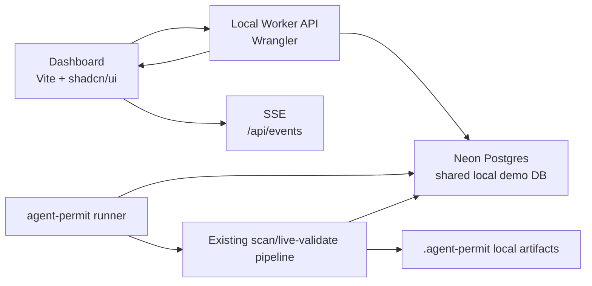

# Local Live Stack Sprint Plan

Date: 2026-06-20

## Purpose

Turn Agent Permit Office from a static local proof-pack viewer into a local live stack:

- CLI queues and runs scans.
- Neon stores shared run state.
- Cloudflare Worker serves a flat API on localhost.
- Dashboard shows real-time scan progress, indexing time, findings, and evidence.

This is a local demo stack, not hosted production. Clerk, R2, PostHog, and managed hosted scan execution stay out of the first implementation.

## Current Baseline

Built:

- Python CLI: `agent-permit scan`, `live-validate`, `investigate`, `eval`, `open-source-demo`.
- Local artifacts: `.agent-permit/runs/<run_id>/`.
- Run metrics: `run-metrics.json`.
- Local analytics events: `analytics-events.jsonl`.
- Dashboard: React/Vite/Bun proof-pack viewer.
- Snapshot export: `tools/export_dashboard_snapshot.py`.

Missing:

- shared database
- Worker API
- live job queue
- local runner daemon
- dashboard API client
- dashboard SSE state
- live indexing progress

## Architecture Decision



Rules:

- Worker never executes local scans.
- Runner executes local scans.
- Postgres stores metadata, statuses, counts, and events.
- `.agent-permit` remains full evidence source.
- API endpoints stay flat, not deeply nested.

## Flat API Contract

```text
GET  /api/snapshot
GET  /api/repos
GET  /api/runs?repoId=...
GET  /api/findings?runId=...
GET  /api/artifacts?runId=...
POST /api/jobs
GET  /api/jobs?status=...
GET  /api/job?id=...
GET  /api/events?jobId=...&after=...
```

`POST /api/jobs` request:

```json
{
  "repo_label": "agent-permit-office",
  "local_path": "/absolute/path/to/repo",
  "mode": "scan",
  "branch": "main"
}
```

Allowed `mode` values:

- `scan`
- `live_validate`

## Database Tables

Initial schema:

- `repositories`
- `scan_jobs`
- `scan_runs`
- `findings`
- `run_events`
- `run_artifacts`
- `model_usage`

Minimum stored fields:

```text
repositories:
  id, label, local_path, branch, created_at, updated_at

scan_jobs:
  id, repository_id, mode, status, requested_at, claimed_at, completed_at, error

scan_runs:
  id, job_id, repository_id, run_id, permit_status, started_at, completed_at,
  files_indexed, high_signal_files, skipped_files, findings_count,
  graph_paths_count, controls_count, artifact_dir

findings:
  id, scan_run_id, finding_id, rule_id, title, severity, status,
  path, line_start, recommendation, risk

run_events:
  id, job_id, scan_run_id, event_name, sequence, occurred_at, payload_json

run_artifacts:
  id, scan_run_id, artifact_type, local_path, sha256, byte_size

model_usage:
  id, scan_run_id, model, model_calls, input_tokens, output_tokens,
  total_tokens, cached_tokens, cache_hit_ratio
```

## Event Contract

Events must be append-only and sequence ordered per job.

Required events:

Sprint 38 scan events:

- `scan_started`
- `inventory_indexed`
- `mcp_scanned`
- `credentials_scanned`
- `prompts_scanned`
- `ci_scanned`
- `capability_graph_built`
- `permit_decided`
- `scan_completed`
- `scan_failed`

Sprint 39 runner/API events:

- `job_queued`
- `job_claimed`
- `investigation_started`
- `investigation_completed`
- `job_completed`
- `job_failed`

`inventory_completed` payload:

```json
{
  "duration_ms": 1234,
  "files_indexed": 4989,
  "high_signal_files": 42,
  "skipped_files": 310
}
```

Generic phase payload:

```json
{
  "duration_ms": 234,
  "findings_delta": 2
}
```

## Local Commands

```bash
export DATABASE_URL="postgresql://..."
uv sync --all-extras --dev
uv run --extra db agent-permit db migrate

bun --cwd worker install
bun --cwd worker run dev -- --var "DATABASE_URL:$DATABASE_URL"

uv run --extra db --extra deep-agent agent-permit runner --poll-interval 1 --concurrency 1

bun --cwd dashboard install
bun --cwd dashboard run dev
```

## Sprint 38: Local Runtime Foundation

Goal:

- create the shared local database and runner foundation without changing scanner behavior

Implementation status:

- implemented on branch `sprint-38-local-live-stack-planning`
- local Python test suite passes: `uv run pytest` -> 123 passed
- local Postgres smoke passes using `DATABASE_URL=postgresql://hudson@127.0.0.1:5432/agent_permit_local`
- remote Neon smoke still requires a Neon connection string

Plane parent:

- `APO-104 Local Live Stack`

Plane mirror:

- Page: `Local Live Stack Sprint Plan` (`dd234559-e65d-4b6b-8932-b191b81a6ebf`)
- Backlog items created: `APO-104` through `APO-112`
- Page linked to: `APO-104`, `APO-110`, `APO-111`, and `APO-112`
- `APO-104` is the Sprint 38 parent/summary item.
- `APO-105` through `APO-109` are the Sprint 38 implementation stories.
- `APO-110`, `APO-111`, and `APO-112` are summary items for Sprints 39-41.
- Plane intake did not preserve parent nesting, so dependencies below are the source of truth for execution order.
- Future sprint sub-stories use planning keys until each sprint is expanded in Plane.

Stories:

| ID | Story | Outcome | Acceptance criteria | Dependencies |
| --- | --- | --- | --- | --- |
| APO-105 | Add Neon local runtime schema | DB can store repos, jobs, runs, events, findings, artifacts, usage. | Migration applies cleanly; tables are idempotent; no raw secret columns. | none |
| APO-106 | Add Python DB adapter | CLI can write to Postgres when `DATABASE_URL` is set. | Optional `db` extra installs adapter; tests use isolated test DB or mocked adapter. | APO-105 |
| APO-107 | Add event publisher abstraction | Existing JSONL analytics remain, DB events become opt-in. | Scan emits events to local JSON and DB sink through one interface. | APO-106 |
| APO-108 | Add `agent-permit db migrate` | Operator can bootstrap DB from CLI. | Command applies migration and prints DB readiness. | APO-105 |
| APO-109 | Add `agent-permit ingest` | Existing `.agent-permit/runs/<run_id>` can populate DB. | Ingest writes run, findings, artifacts, usage, events. | APO-106 |

Done when:

- `uv run --extra db agent-permit db migrate` works.
- `uv run --extra db agent-permit ingest .agent-permit/runs/<run_id>` populates Postgres.
- Existing scan tests still pass without `DATABASE_URL`.

Current implementation:

- `agent-permit db migrate` applies `local_live_stack_v1` when `DATABASE_URL` is set.
- `agent-permit ingest .agent-permit/runs/<run_id>` loads repository, job, run, findings, artifacts, model usage, and events.
- `agent-permit scan` still writes JSONL analytics without DB config.
- `agent-permit scan` also writes DB event/run state when `DATABASE_URL` is set.
- Optional DB dependency is behind `uv run --extra db`.

## Sprint 39: Worker API And Runner Queue

Goal:

- make dashboard-created jobs executable by a local runner and readable through a flat Worker API

Current implementation:

- `worker/` contains a Cloudflare Worker API package using Bun, Wrangler, generated Worker runtime types, and `pg` with `nodejs_compat`.
- Worker endpoints implemented: `GET /api/health`, `GET /api/repos`, `GET /api/runs`, `GET /api/findings`, `GET /api/snapshot`, `POST /api/jobs`, `GET /api/events?jobId=&after=`.
- `POST /api/jobs` validates absolute local paths and inserts queued jobs using the same stable repository ID contract as the Python runtime.
- `agent-permit runner --once` claims one queued job from Postgres, runs the local scanner, links the run back to the queued job, and marks the job complete or failed.
- Worker checks pass locally: `bun run check`, `bun test`.
- Python runner checks pass locally via targeted pytest.
- End-to-end local DB smoke passed through Worker `POST /api/jobs`, `agent-permit runner --once`, Worker `/api/snapshot`, and Worker `/api/events?jobId=&after=`.
- Remote Neon smoke remains gated on a Neon connection string.

Stories:

| Planning key | Story | Outcome | Acceptance criteria | Dependencies |
| --- | --- | --- | --- | --- |
| S39-01 | Scaffold Worker API | Wrangler serves flat API on localhost. | `/api/repos`, `/api/runs`, `/api/findings`, `/api/snapshot` return DB-backed JSON. | APO-105 |
| S39-02 | Add job creation endpoint | Dashboard can queue scan jobs. | `POST /api/jobs` validates mode/path/label and inserts queued job. | S39-01 |
| S39-03 | Add runner daemon | Local process claims jobs and runs scanner. | `agent-permit runner` claims one queued job and updates status. | APO-107, S39-02 |
| S39-04 | Add SSE event endpoint | Dashboard can subscribe to run progress. | `/api/events?jobId=&after=` streams ordered events and resumes after cursor. | S39-01, S39-03 |
| S39-05 | Add runner failure handling | Failed scans do not hang queue. | Job and run mark failed, error stored redacted, `run_failed` emitted. | S39-03 |

Done when:

- `POST /api/jobs` creates a queued job.
- Runner claims and completes it.
- `/api/snapshot` updates without running snapshot exporter.
- SSE shows phase events during run.

## Sprint 40: Dashboard Live Mode

Goal:

- replace static-only dashboard with API-backed live mode while preserving static fallback

Stories:

| Planning key | Story | Outcome | Acceptance criteria | Dependencies |
| --- | --- | --- | --- | --- |
| S40-01 | Add dashboard API client | UI reads `/api/snapshot` first. | If API succeeds, static JSON is not used; if API fails, bundled snapshot renders with static label. | S39-01 |
| S40-02 | Wire `Queue scan` form | User can queue local repo scan from UI. | Form posts label/path/mode; shows queued job status. | S39-02, S40-01 |
| S40-03 | Add live run progress | UI shows current phase and elapsed/indexing metrics. | SSE updates current phase, files indexed, high-signal files, final duration. | S39-04 |
| S40-04 | Refresh findings on completion | New run appears in queue automatically. | `run_completed` triggers snapshot refetch; search/filter/detail still work. | S40-03 |
| S40-05 | Add local stack docs | Another engineer can run the stack from scratch. | README or docs include Neon, Worker, runner, dashboard commands. | S40-01 |

Done when:

- Queue scan from dashboard.
- Runner scans repo.
- Dashboard updates in real time.
- Completed run and findings visible without generated snapshot file.

## Sprint 41: Hardening And Demo Script

Goal:

- make local live stack reliable enough for a recorded demo and open-source contributor setup

Stories:

| Planning key | Story | Outcome | Acceptance criteria | Dependencies |
| --- | --- | --- | --- | --- |
| S41-01 | Add E2E local demo fixture | One command validates full loop against fixture repo. | Test queues fixture, runner completes, API returns run and findings. | S40-04 |
| S41-02 | Add redaction audit for DB payloads | DB writes never store raw secrets. | Tests reject forbidden keys and scan event payloads. | APO-107 |
| S41-03 | Add dashboard empty/loading/error states | Local stack failures are understandable. | UI shows API unavailable, runner not active, no jobs, no findings states. | S40-01 |
| S41-04 | Add demo runbook | Recorded demo path is repeatable. | Doc has setup, queue scan, watch progress, open finding, explain value. | S41-01 |

Done when:

- local live stack demo takes under 10 minutes from env-ready machine
- deterministic fixture E2E passes
- no static snapshot regeneration needed for live demo

## Acceptance Tests

Python:

- migration creates all tables
- runner claims only one job under concurrent polling
- scan emits ordered events
- failed scan marks job failed
- ingest loads existing run artifacts

Worker:

- flat endpoints return expected JSON
- job creation validates payload
- SSE streams only events newer than `after`
- unavailable DB returns safe error JSON

Dashboard:

- queue form creates job
- live progress updates
- completed run appears in table
- search/filter still work
- detail page still opens from selected row
- static fallback still works

End-to-end:

- queue fixture repo
- runner scans it
- dashboard shows indexing time
- dashboard shows findings and evidence detail without regenerating static JSON

## Source References

Internal:

- `docs/dashboard-stack-architecture.md`
- `docs/proof-pack-viewer-rebuild-plan.md`
- `docs/permitgraph-dashboard-snapshot-contract.md`
- `docs/product-analytics-evals-roadmap.md`
- `src/agent_permit/cli.py`
- `src/agent_permit/artifacts.py`
- `src/agent_permit/analytics.py`

External:

- Cloudflare Workers: https://developers.cloudflare.com/workers/
- Cloudflare Workers Postgres: https://developers.cloudflare.com/workers/tutorials/postgres/
- Cloudflare Hyperdrive: https://developers.cloudflare.com/hyperdrive/
- Cloudflare Hyperdrive local development: https://developers.cloudflare.com/hyperdrive/configuration/local-development/
- Cloudflare Agents HTTP/SSE: https://developers.cloudflare.com/agents/runtime/communication/http-sse/
- Neon with Cloudflare Workers: https://developers.cloudflare.com/workers/databases/third-party-integrations/neon/
- Server-Sent Events: https://developer.mozilla.org/en-US/docs/Web/API/Server-sent_events
