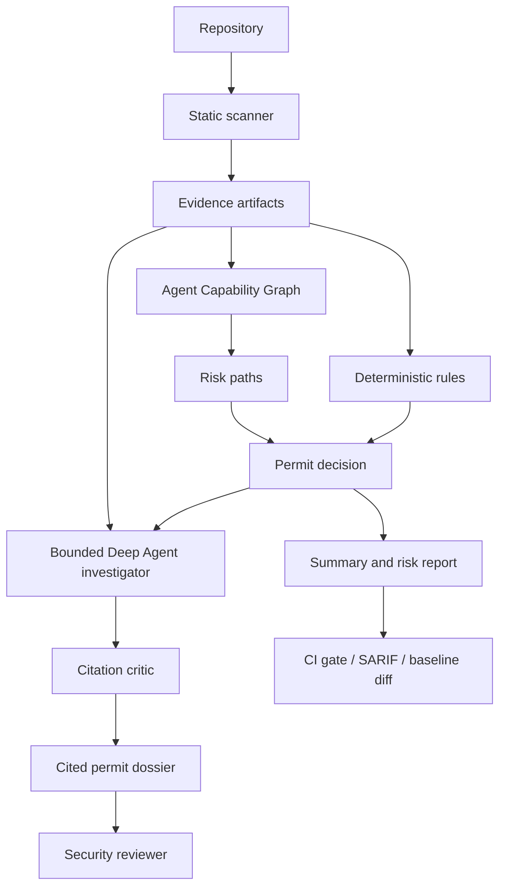

# Product Scope And Market Review

Date: 2026-06-07

## Executive Read

Agent Permit Office is most compelling as a narrow, evidence-first permit gate for AI agent access.

Do not position it as:

- generic SAST
- generic AI firewall
- generic AI-SPM
- generic LLM observability
- runtime agent gateway

Position it as:

```text
A pre-production and CI permit office for AI agents before they receive tools, credentials, memory, MCP servers, or production access.
```

The wedge is valuable because agent security is becoming a named category, but broad enterprise vendors are already moving fast. The open-core opportunity is to own a developer-first, transparent, static-plus-agentic review layer that bigger platforms can later integrate with or compete against.

## Repo Hygiene Review

Snapshot from Sprint 27:

| Metric | Result | Assessment |
| --- | ---: | --- |
| Git object size | 3.18 MiB | small |
| Tracked files | 114 | reasonable for MVP |
| Tracked Markdown files | 44 | high but mostly canonical planning/docs |
| Unit test files | 26 | healthy |
| Largest tracked file | `uv.lock` at 664 KiB | expected |
| Wheel package | 312 KiB, 33 files | lean |
| Source distribution | 452 KiB | includes docs/tests/workflows; acceptable |
| Local repo directory | 550 MiB | dominated by ignored `.venv` |
| Ignored virtualenv | 542 MiB | not repo bloat |
| Ignored scan artifacts | 2.6 MiB | acceptable local evidence |

Safe cleanup already done:

- removed generated `dist/`
- removed `.pytest_cache/`
- removed Python `__pycache__/` folders created during local gates

Not deleted:

- `.agent-permit/`: ignored local evidence from validation and demo runs
- `.env.local`: ignored local secret-bearing config
- docs: currently useful product memory and launch material
- two GitHub workflows: `ci.yml` tests the repo; `agent-permit.yml` dogfoods the composite action

Current bloat risks:

| Surface | Risk | Decision |
| --- | --- | --- |
| `docs/project-management-sprint-plan.md` | Will keep growing every sprint. | Keep for now; split into `docs/sprints/` after public launch. |
| Planning docs | Many docs can overwhelm first-time users. | Keep but add curated README paths and later docs index. |
| Optional extras | Phoenix and Deep Agent extras are heavy. | Keep optional; base runtime is lean. |
| Source distribution | Includes docs/tests/workflows. | Acceptable for OSS; wheel remains lean. |
| Generated `.agent-permit/` | Can accumulate locally. | Keep ignored; add cleanup command later if needed. |

No tracked source deletion is recommended right now.

## What We Built

Agent Permit Office now has four layers.

### 1. Deterministic Scanner

Static scanner creates evidence without executing code.

Current coverage:

- file inventory and skip logic
- MCP config parsing
- prompt/instruction scan
- credential reference detection
- GitHub Actions CI scan
- Agent Capability Graph
- source-to-sink path finder
- deterministic controls and permit decision
- SARIF output
- baseline/diff
- repo policy config

Primary artifacts:

- `file-inventory.json`
- `agent-bom.json`
- `raw-findings.json`
- `codebase-map.json`
- `graph-paths.json`
- `controls.json`
- `permit.yaml`
- `risk-report.md`
- `summary.md`
- `results.sarif`

### 2. Required Deep Agent Investigator

The Deep Agent is not optional in the product story. It is the explanation layer over deterministic facts.

It does not decide facts from scratch. It:

- reads bounded evidence tools
- writes a cited permit narrative
- uses MCP, prompt, policy, and critic subagent roles
- defaults to Claude Sonnet 4.6 through OpenRouter
- supports GPT-5.5 escalation
- writes usage/cache metrics when available
- passes through a deterministic citation critic

This keeps the system from becoming a free-roaming security chatbot.

### 3. Validation And Observability

Built:

- fixture evals
- real-repo eval manifest
- live validation harness
- open-source live validation manifest
- one-command open-source demo
- local Phoenix trace/export path
- OpenRouter prompt/response caching and usage metrics

This is strong for an MVP because it creates a measurable agent quality loop instead of relying on demos alone.

### 4. Public Launch Surface

Built:

- Apache-2.0 license
- `SECURITY.md`
- `CONTRIBUTING.md`
- `SUPPORT.md`
- `CODE_OF_CONDUCT.md`
- `ROADMAP.md`
- `CHANGELOG.md`
- normal CI workflow
- composite GitHub Action
- sanitized demo artifact strategy

## How It Works

Flow:



Product outcomes:

| Permit | Meaning | Typical action |
| --- | --- | --- |
| `approved` | No blocking agent-access risk found. | Allow merge or continue review. |
| `approved_with_conditions` | Risk exists but controls reduce it. | Require documented controls. |
| `needs_review` | Human review needed before granting access. | Review findings and policies. |
| `blocked` | Critical path exists. | Do not grant agent/tool/credential access. |

## Value Proposition

For developers:

- fast local scan
- clear rule IDs and file/line evidence
- CI gate before agent permissions land
- no need to upload private repo data
- no-spend deterministic path
- cited Deep Agent dossier when an investigation report is needed

For AppSec/platform security:

- inventory of agent-relevant surfaces
- consistent permit decision
- line-cited findings
- reviewable exceptions through policy config
- SARIF/code scanning path
- baseline/diff adoption for noisy existing repos
- audit-ready narrative from bounded Deep Agent

For enterprise buyers:

- reduces unmanaged agent and MCP adoption risk
- creates a repeatable approval workflow
- turns agent access decisions into evidence artifacts
- supports future policy packs, approval queues, and retention controls

## Market Context

The category is real, but the broad market is already contested.

Signals:

- OWASP has a dedicated MCP Top 10 covering secret exposure, scope creep, tool poisoning, command execution, audit gaps, shadow MCP servers, and context over-sharing.
- OWASP also has an Agentic Security Initiative and Agentic Skills Top 10, which validates the exact middle layer this product cares about: agent skills, tools, and behavioral execution.
- Wiz AI-SPM emphasizes AI inventory, AI-BOM, tool identification, attack-path analysis, runtime protection, and AI investigation.
- Snyk announced MCP-focused secure-at-inception capabilities inside its AI Trust Platform.
- Palo Alto Prisma AIRS Agent Security covers agent identity, source/supply-chain scanning, MCP connections, runtime control, and behavior testing.
- Lakera focuses on runtime GenAI and AI Agent Security with prompt attack prevention, data leakage protection, and AI red teaming.
- Protect AI positions as a broad AI security platform across model selection, testing, runtime, and beyond.
- Prompt Security/SentinelOne covers AI development usage, homegrown AI apps, prompt injection, data leakage, shadow agents, MCP connections, and runtime policy.

Implication:

```text
The opportunity is not "build a broad AI security platform." The opportunity is "own the transparent permit gate for developer-controlled agents before access is granted."
```

## Niche

Best niche:

```text
Open-source, evidence-first CI permit gate for AI agents, MCP servers, repo-level agent instructions, and credential/tool access.
```

Why this niche survives:

- narrow enough to build credibility
- transparent enough for security engineers
- practical enough for developers
- early enough for MCP/agent adoption
- adjacent to enterprise budgets without needing to out-platform Wiz or Palo Alto

Where it fits:

| Category | Existing tools | Agent Permit Office fit |
| --- | --- | --- |
| SAST | Code vulnerabilities | Agent access, MCP, prompt, workflow, credential paths. |
| AI-SPM | Cloud-wide AI inventory/posture | Repo-level permit evidence before deployment. |
| Runtime AI firewall | Prompt/output enforcement | Pre-production static and dossier review. |
| LLM observability | Traces/evals | Permit artifacts plus optional Phoenix traces. |
| GRC | Controls/evidence | Technical evidence packet feeding approval workflows. |

## Weaknesses

Current weaknesses:

- static-only; no runtime enforcement
- limited scanner surface area
- no hosted dashboard
- no private repo connector
- no identity/RBAC model
- no organization-level policy management
- no signed release or package distribution yet
- no public user feedback
- no commercial design partners
- no dynamic MCP/server behavior testing
- no formal mapping to OWASP Agentic/MCP controls yet

Product risks:

- broad platforms can copy the high-level story
- open-source scanner needs strong rule quality to earn trust
- false positives can block adoption
- Deep Agent cost and latency must stay bounded
- market may prefer runtime gateway controls over pre-permit CI gates
- security buyers may ask for broad AI inventory before narrow repo permit checks

Mitigation:

- stay narrow
- publish rule IDs and examples
- map rules to OWASP MCP and Agentic risks
- keep baseline/diff for gradual adoption
- make Deep Agent output citation-checked and cost-metered
- build hosted workflow only after CLI usage is validated

## Open-Core Business

Free open core:

- CLI scanner
- deterministic rules
- artifact schemas
- permit engine
- local Deep Agent investigation
- citation critic
- SARIF
- baseline/diff
- repo policy config
- local evals and Phoenix support
- GitHub Action
- public fixtures and validation manifests

Paid product:

- hosted dashboard
- GitHub app/private repo connectors
- scheduled scans
- team approval queues
- shared org policy profiles
- compliance/control mappings
- custom rule packs
- SSO/RBAC
- audit evidence retention
- managed LLM gateway and spend controls
- enterprise support
- self-hosted/VPC deployment

Best first paid wedge:

```text
Team dashboard for multi-repo agent permit review, policy exceptions, and approval evidence.
```

Avoid monetizing the CLI too early. The open-source core is the trust and distribution channel.

## Customer Discovery Plan

Target interviews:

- 5 AI platform engineers
- 5 AppSec/security engineers
- 3 DevSecOps or platform owners
- 2 compliance/GRC stakeholders

Discovery questions:

- Where are agents getting tool access today?
- Who approves MCP servers or repo-level agent instructions?
- Are AI coding agents allowed in CI?
- What evidence would security need before approving an agent?
- What scares the team more: prompt injection, credentials, data exfiltration, or runaway write access?
- How many repos would need this gate?
- Would this belong in CI, GitHub app, internal developer portal, or security dashboard?
- Would the team accept a static-only gate if it produced strong evidence?
- What false-positive rate would kill adoption?
- Who owns exceptions?
- Would they bring their own model key or require managed model routing?
- What would make this worth paying for?

Proof artifacts to show:

- local safe fixture scan
- risky CI fixture blocked permit
- risky MCP fixture needs-review permit
- open-source demo HTML report
- Deep Agent cited permit dossier
- SARIF/code scanning path
- baseline/diff adoption path

Success criteria:

- 3 teams say they have no current approval path for agents/MCP
- 3 teams ask to test on a private repo
- 2 teams identify a buyer or budget owner
- 1 team agrees to a design-partner pilot

## Next Product Work

Highest-leverage next steps:

1. Map current deterministic rules to OWASP MCP Top 10 and OWASP Agentic risks.
2. Add sanitized public demo artifact.
3. Add GitHub issue templates for false positives and rule requests.
4. Split the sprint plan into archived sprint docs if it keeps growing.
5. Build first hosted mock or lightweight dashboard only after customer discovery validates workflow.
6. Add rule coverage for agent skills and package/tool provenance.
7. Add a `clean` or `doctor` command for local generated artifacts.

## Sources

- OWASP MCP Top 10: https://owasp.org/www-project-mcp-top-10/
- OWASP Agentic Security Initiative: https://genai.owasp.org/initiatives/agentic-security-initiative/
- OWASP Agentic Skills Top 10: https://owasp.org/www-project-agentic-skills-top-10/
- Wiz AI-SPM: https://www.wiz.io/solutions/ai-spm
- Snyk Secure At Inception: https://snyk.io/news/snyk-unveils-secure-at-inception/
- Palo Alto Prisma AIRS Agent Security: https://www.paloaltonetworks.com/prisma/agent-security
- Lakera AI Security: https://www.lakera.ai/
- Protect AI: https://protectai.com/
- Prompt Security / SentinelOne AI Security: https://www.sentinelone.com/platform/securing-ai-prompt/
