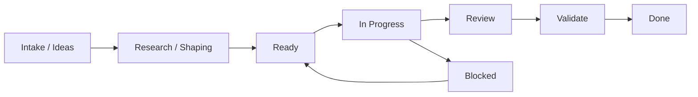
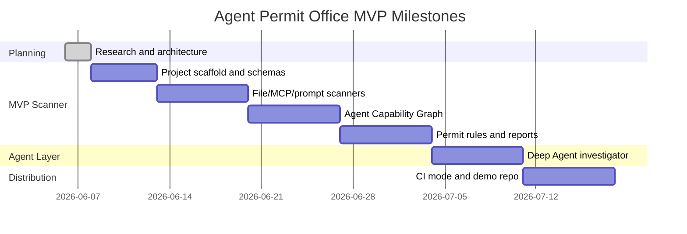

# Project Management And Sprint Plan

Date: 2026-06-06

## Operating Decision

Use Agile Kanban with short sprint planning.

Reason:

- this is still an investigation-stage product
- research will keep changing the backlog
- strict Scrum would create ceremony before the product is real
- pure Kanban would lack milestone pressure

Working model:

```text
weekly planning + Kanban flow + milestone-based demos
```

## Tooling Decision

| System | Use now | Use later | Reason |
| --- | --- | --- | --- |
| Repo Markdown | yes | yes | Best current source of truth while idea is still forming. |
| GitHub Issues | not yet | yes | Useful once code scaffold exists and tasks become implementation units. |
| GitHub Projects | not yet | yes | Good lightweight Kanban board after first issues exist. |
| Linear | optional later | yes if this becomes serious delivery work | Best execution system if this becomes a real product effort. |
| Notion | optional later | yes for write-ups and investor/customer narrative | Better for long-form product story and market notes. |

Do not create external project-management systems until the first implementation milestone is ready. For now, repo docs stay source of truth.

## Board Model



### Lanes

| Lane | Meaning | Exit rule |
| --- | --- | --- |
| Intake / Ideas | Raw ideas, papers, competitor notes, feature thoughts. | Has owner, problem, and reason to consider. |
| Research / Shaping | Needs analysis before build. | Has clear user outcome and acceptance criteria. |
| Ready | Small enough for Codex or human implementation. | Can be started without more product debate. |
| In Progress | Active work. | Code/doc changes complete. |
| Review | Needs human/product/technical review. | Decision made or changes requested. |
| Validate | Needs tests, demo, fixture, or scan result. | Evidence proves it works. |
| Done | Delivered and documented. | Meets definition of done. |
| Blocked | Cannot move without external decision/input. | Blocker removed or scope changed. |

### WIP Limits

| Lane | Limit |
| --- | --- |
| Research / Shaping | 3 |
| In Progress | 2 |
| Review | 3 |
| Validate | 2 |

Rule:

> If WIP is full, finish or cut scope before starting new work.

## Work Item Shape

Every implementation issue should use:

```text
Problem:

Outcome:

Scope:

Acceptance Criteria:

Non-Goals:

Evidence Required:
```

Example:

```text
Problem:
We cannot issue a permit until repo facts are represented in a stable schema.

Outcome:
Pydantic schemas exist for scan runs, facts, graph nodes, findings, evidence packs, and permits.

Acceptance Criteria:
- Schemas serialize to JSON.
- Fixtures cover at least safe and risky examples.
- Tests prove no secret values are emitted.

Evidence Required:
- pytest output
- sample .agent-permit run artifacts
```

## Labels

Use these labels when GitHub Issues or Linear starts.

| Label | Meaning |
| --- | --- |
| `type:research` | Paper, OSS, competitor, or architecture analysis. |
| `type:scanner` | Deterministic parser or detection work. |
| `type:graph` | Agent Capability Graph and path logic. |
| `type:policy` | Rule engine, severity, permit logic. |
| `type:agent` | LangGraph/Deep Agent investigation layer. |
| `type:reporting` | Markdown, JSON, SARIF, HTML, CI output. |
| `type:fixtures` | Test repos, examples, expected outcomes. |
| `type:ops` | Project management, docs, workflow setup. |
| `risk:security` | Secret handling, sandboxing, execution safety. |
| `phase:mvp` | Required for first usable CLI. |
| `phase:later` | Useful but not MVP. |

## Definition Of Ready

A task is ready when:

- one user/outcome is named
- scope is small enough for one PR or one doc
- inputs and outputs are clear
- acceptance criteria are testable
- non-goals are written
- risk level is known

## Definition Of Done

A task is done when:

- implementation or doc exists
- tests/checks run where applicable
- artifact path is linked
- no unrelated files changed
- no secret values printed or stored
- next dependency is clear

For docs-only work:

- Markdown renders
- README or index links it when relevant
- diagrams are valid enough for GitHub/Mermaid

For scanner work:

- unit tests pass
- fixture demonstrates finding
- output includes file path and line evidence
- raw secret values are never emitted

## Milestones



Dates are planning anchors, not commitments.

## Sprint 0: Research And Architecture

Status: done.

Goal:

- prove product direction and technical architecture

Delivered:

- LangChain/Deep Agents architecture research
- scanner/model plan
- codebase indexing plan
- research-backed static-analysis plan
- end-to-end system diagram
- project-management plan

Exit criteria:

- build-vs-leverage boundary clear
- phase-one scope clear
- next implementation tasks clear

## Sprint 1: Scaffold And Schemas

Status: done.

Goal:

- create first runnable CLI skeleton and stable artifact schemas

Backlog:

| Item | Outcome | Acceptance criteria |
| --- | --- | --- |
| Python project scaffold | `uv` project with package layout. | `uv run pytest` works; CLI imports. |
| Pydantic models | Stable schemas for facts, graph nodes, findings, evidence, permits. | JSON serialization tests pass. |
| Run directory writer | `.agent-permit/runs/<run_id>/` contract exists. | Sample run writes metadata JSON. |
| Fixture structure | Safe and risky sample repos exist. | Fixtures are small and committed. |
| CLI command | `agent-permit scan <path>` creates a scan run. | Returns summary and artifact path. |

Non-goals:

- Deep Agent
- external scanners
- hosted services
- MCP execution

## Sprint 2: First Deterministic Scanners

Status: done.

Goal:

- extract high-signal facts without AI

Backlog:

| Item | Outcome | Acceptance criteria |
| --- | --- | --- |
| File inventory scanner | Classifies repo files and skips junk. | Done: metadata-only inventory, `.gitignore`, junk-dir, sensitive-env skip tests. |
| MCP config scanner | Finds stdio/remote MCP servers and env refs. | Done: static JSON parser, no execution, env var names only, unpinned stdio package finding. |
| Prompt scanner | Finds unsafe instructions and approval bypass phrases. | Done: instruction-only scan, line-cited evidence, secret-redacted snippets, poisoned fixture coverage. |
| Credential reference scanner | Records secret variable names only. | Done: `.env.example`, Python, JS, and TS env-access refs, real `.env` skip, redaction coverage. |
| CI scanner | Detects dangerous GitHub Actions patterns. | Done: `pull_request_target`, write permissions, secret refs, PR-head checkout, risky fixture coverage. |

## Sprint 3: Agent Capability Graph

Status: done.

Goal:

- turn facts into graph paths that support permit logic

Backlog:

| Item | Outcome | Acceptance criteria |
| --- | --- | --- |
| Graph builder | Nodes and edges generated from scanner facts. | Done: deterministic `codebase-map.json` for files, MCP, credentials, prompt instructions, and CI workflows. |
| Source/sink taxonomy | Standard categories for sensitive sources and dangerous sinks. | Done: `graph-paths.json` classifies credentials, repo config, workflow files, MCP servers, endpoints, risky instructions, and privileged workflows. |
| Path finder | Finds bounded source-to-sink paths. | Done: credential-to-MCP, repo-config-to-network, workflow-to-privileged-CI, and instruction-to-risky-instruction paths. |
| Control model | Represents approval gates, pinning, sandboxing, read-only tokens. | Done: `controls.json`, deterministic permit status, fixture status mapping, and risk report output. |

## Sprint 4: Permit Engine And Reports

Status: in progress.

Goal:

- produce decision-quality artifacts

Backlog:

| Item | Outcome | Acceptance criteria |
| --- | --- | --- |
| Rule engine | 15 to 25 deterministic rules. | Fixture expected findings pass. |
| Severity scoring | Consistent critical/high/medium/low. | Tests cover score changes from controls. |
| Permit status | approved, approved_with_conditions, needs_review, blocked. | Fixtures map to expected statuses. |
| Markdown report | Human-readable risk report. | In progress: `risk-report.md` plus PR-friendly `summary.md` written per scan. |
| JSON/YAML artifacts | Machine-readable outputs. | In progress: `permit.yaml`, `controls.json`, `graph-paths.json`, and scanner JSON artifacts covered by tests. |

## Sprint 5: Deep Agent Investigator

Goal:

- add LangGraph/Deep Agents only after scanner evidence exists

Backlog:

| Item | Outcome | Acceptance criteria |
| --- | --- | --- |
| Controlled tools | Deep Agent reads evidence packs and graph summaries only. | Done: evidence tools expose bounded artifacts only; `codebase-map.json` and repo files are not readable. |
| Coordinator prompt | Agent writes cited permit narrative. | Done: `agent-permit investigate` writes citation-checked Markdown. |
| Specialist subagents | MCP, prompt, policy, and critic roles. | Done: optional Deep Agents specs define MCP, prompt, policy, and citation critic subagents. |
| LangSmith tracing | Optional trace visibility. | Done: `--langsmith` requests tracing for live Deep Agent runs; tracing stays off by default. |
| Report critic | Checks unsupported claims and missing citations. | Done: tests catch invented finding citations and unsupported rule IDs. |

## Sprint 6: CI And Demo

Goal:

- make the project usable by another developer

Backlog:

| Item | Outcome | Acceptance criteria |
| --- | --- | --- |
| CI mode | `agent-permit scan . --ci`. | Done: exits non-zero for `needs_review` and `blocked`. |
| Markdown summary | PR-friendly output. | Done: `summary.md` includes status, counts, top findings, and artifact list. |
| SARIF research spike | Decide whether SARIF belongs in MVP. | Done: defer first-class SARIF from MVP until GitHub Action packaging and stable rule IDs exist. |
| Demo repo | Public-ready example showing value. | Done: `docs/demo.md` uses safe and risky fixtures to show approved and blocked paths. |
| Setup docs | Clear install/run instructions. | Done: README plus `docs/github-action.md` document local, CI, exclusions, artifacts, and Action use. |

## Sprint 7: MVP Hardening

Goal:

- reduce drift before broader real-repo use

Backlog:

| Item | Outcome | Acceptance criteria |
| --- | --- | --- |
| Rule registry | Stable deterministic rule catalog. | Done: `rule_registry.py`, `agent-permit rules`, fixture rule coverage tests. |
| Real repo smoke | Scan non-fixture repo path. | Done: local self-scan with `--exclude "tests/fixtures/**"` returns `approved`. |
| Artifact UX | Easier operator inspection. | Done: rules command plus MVP hardening docs. |

## Sprint 8: Real Repo Validation

Goal:

- prove scanner behavior outside fixtures

Backlog:

| Item | Outcome | Acceptance criteria |
| --- | --- | --- |
| Typed evidence tools | Deep Agent uses structured access instead of raw artifact reads where possible. | Done: finding/path/BOM/MCP/credential/rule helpers covered by tests. |
| Public repo smoke | Scan real public agent repos. | Done: three shallow public clones scanned and investigated. |
| False-positive review | Capture validation-driven scoring fixes. | Done: CI workflow path severity changed from critical to high. |
| Validation write-up | Record results and next hardening gaps. | Done: `docs/real-repo-validation.md`. |

## Sprint 9: CI Context Hardening

Goal:

- make CI findings directly actionable

Backlog:

| Item | Outcome | Acceptance criteria |
| --- | --- | --- |
| Workflow context | Findings include event, job, permission scope, and secret name. | Done: evidence locations carry structured CI context. |
| Maintenance confidence | Maintenance workflows are still reviewed but marked lower confidence. | Done: stale/dependabot/triage heuristics set medium confidence. |
| Report UX | Top findings show relevant CI context. | Done: summary and risk report include event/job/scope/secret notes. |
| Public repo revalidation | Confirm context on public repos. | Done: `validation5-*` runs documented in `docs/ci-context-hardening.md`. |

## Sprint 10: Phoenix Observability And Evals

Goal:

- make agent behavior measurable without requiring hosted tracing

Backlog:

| Item | Outcome | Acceptance criteria |
| --- | --- | --- |
| Phoenix tracing | Live Deep Agent runs can emit OpenTelemetry traces to local Phoenix. | Done: `investigate --phoenix` initializes Phoenix before Deep Agent creation. |
| Local eval harness | Deterministic fixture regression suite writes reviewable artifacts. | Done: `agent-permit eval tests/fixtures` writes `eval-results.json` and `eval-report.md`. |
| Fixture truth refresh | Fixture manifests use stable deterministic rule IDs. | Done: manifests compare exact scanner rule IDs. |
| Observability docs | Operator can run local Phoenix and evals. | Done: `docs/phoenix-observability-evaluation.md`. |

## Sprint 11: Phoenix Trace Quality

Goal:

- make traces and eval artifacts useful for debugging agent quality

Backlog:

| Item | Outcome | Acceptance criteria |
| --- | --- | --- |
| Evidence tool spans | Phoenix traces show every bounded evidence tool call. | Done: tool wrappers emit OpenTelemetry span metadata without storing raw inputs. |
| Dataset row export | Eval results can seed Phoenix-style datasets later. | Done: eval writes `phoenix-dataset-rows.jsonl` with stable IDs, inputs, outputs, and metadata. |
| Quality metrics | Local eval captures investigation quality signals. | Done: status, rule ID, citation, secret-leak checks produce `quality_score`. |
| Docs | Operator understands trace fields and export file. | Done: Phoenix and Deep Agent docs updated. |

## Sprint 12: Phoenix Live Validation

Goal:

- prove local Phoenix can receive eval datasets without making hosted observability required

Backlog:

| Item | Outcome | Acceptance criteria |
| --- | --- | --- |
| Upload flag | Operator explicitly uploads eval rows to Phoenix. | Done: `agent-permit eval --upload-phoenix` calls Phoenix client only when requested. |
| Stable dataset examples | Repeated uploads do not create uncontrolled duplicate fixtures. | Done: upload uses stable fixture example IDs. |
| Failure boundary | Missing server/client fails only explicit upload path. | Done: default eval remains local; upload failures return non-zero. |
| Live validation docs | Operator can start Phoenix and validate dataset connectivity. | Done: Phoenix docs include upload command and checklist. |

## Release Criteria For MVP

MVP is ready when:

- local CLI scans a real repo
- at least three risky fixture repos are detected correctly
- fixture eval suite passes locally
- no raw secret values are emitted
- findings have file and line evidence
- permit status is deterministic
- Deep Agent report is optional
- README has install and demo commands

## Project Management Setup Later

When code scaffold exists, create:

- GitHub milestone: `MVP Scanner`
- GitHub project board: `Agent Permit Office`
- issues from Sprint 1 and Sprint 2 backlog

When this becomes a committed product effort, create Linear project:

- Project: `Agent Permit Office MVP`
- Milestones:
  - `Scanner Core`
  - `Agent Capability Graph`
  - `Permit Engine`
  - `Deep Agent Investigator`
  - `CI/Demo`

Notion page later:

- `Agent Permit Office Product Brief`
- include problem, buyer, architecture diagram, roadmap, demo story, and market map

## Immediate Next Step

Start Sprint 1.

First implementation task:

```text
Create Python project scaffold, schemas, artifact writer, and no-op CLI.
```

This gives the project a real delivery spine. Everything else can attach to it.
