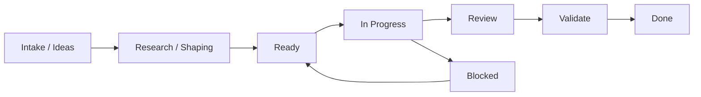
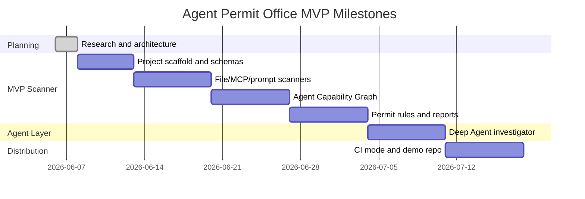

# Project Management And Sprint Plan

Date: 2026-06-06

## Operating Decision

Use Agile Kanban with short sprint planning.

Reason:

- this is still an investigation-stage product
- research will keep changing the backlog
- strict Scrum would create ceremony before the product is real
- pure Kanban would lack milestone pressure

Working model:

```text
weekly planning + Kanban flow + milestone-based demos
```

## Tooling Decision

| System | Use now | Use later | Reason |
| --- | --- | --- | --- |
| Repo Markdown | yes | yes | Best current source of truth while idea is still forming. |
| GitHub Issues | not yet | yes | Useful once code scaffold exists and tasks become implementation units. |
| GitHub Projects | not yet | yes | Good lightweight Kanban board after first issues exist. |
| Linear | optional later | yes if this becomes serious delivery work | Best execution system if this becomes a real product effort. |
| Notion | optional later | yes for write-ups and investor/customer narrative | Better for long-form product story and market notes. |

Do not create external project-management systems until the first implementation milestone is ready. For now, repo docs stay source of truth.

## Board Model



### Lanes

| Lane | Meaning | Exit rule |
| --- | --- | --- |
| Intake / Ideas | Raw ideas, papers, competitor notes, feature thoughts. | Has owner, problem, and reason to consider. |
| Research / Shaping | Needs analysis before build. | Has clear user outcome and acceptance criteria. |
| Ready | Small enough for Codex or human implementation. | Can be started without more product debate. |
| In Progress | Active work. | Code/doc changes complete. |
| Review | Needs human/product/technical review. | Decision made or changes requested. |
| Validate | Needs tests, demo, fixture, or scan result. | Evidence proves it works. |
| Done | Delivered and documented. | Meets definition of done. |
| Blocked | Cannot move without external decision/input. | Blocker removed or scope changed. |

### WIP Limits

| Lane | Limit |
| --- | --- |
| Research / Shaping | 3 |
| In Progress | 2 |
| Review | 3 |
| Validate | 2 |

Rule:

> If WIP is full, finish or cut scope before starting new work.

## Work Item Shape

Every implementation issue should use:

```text
Problem:

Outcome:

Scope:

Acceptance Criteria:

Non-Goals:

Evidence Required:
```

Example:

```text
Problem:
We cannot issue a permit until repo facts are represented in a stable schema.

Outcome:
Pydantic schemas exist for scan runs, facts, graph nodes, findings, evidence packs, and permits.

Acceptance Criteria:
- Schemas serialize to JSON.
- Fixtures cover at least safe and risky examples.
- Tests prove no secret values are emitted.

Evidence Required:
- pytest output
- sample .agent-permit run artifacts
```

## Labels

Use these labels when GitHub Issues or Linear starts.

| Label | Meaning |
| --- | --- |
| `type:research` | Paper, OSS, competitor, or architecture analysis. |
| `type:scanner` | Deterministic parser or detection work. |
| `type:graph` | Agent Capability Graph and path logic. |
| `type:policy` | Rule engine, severity, permit logic. |
| `type:agent` | LangGraph/Deep Agent investigation layer. |
| `type:reporting` | Markdown, JSON, SARIF, HTML, CI output. |
| `type:fixtures` | Test repos, examples, expected outcomes. |
| `type:ops` | Project management, docs, workflow setup. |
| `risk:security` | Secret handling, sandboxing, execution safety. |
| `phase:mvp` | Required for first usable CLI. |
| `phase:later` | Useful but not MVP. |

## Definition Of Ready

A task is ready when:

- one user/outcome is named
- scope is small enough for one PR or one doc
- inputs and outputs are clear
- acceptance criteria are testable
- non-goals are written
- risk level is known

## Definition Of Done

A task is done when:

- implementation or doc exists
- tests/checks run where applicable
- artifact path is linked
- no unrelated files changed
- no secret values printed or stored
- next dependency is clear

For docs-only work:

- Markdown renders
- README or index links it when relevant
- diagrams are valid enough for GitHub/Mermaid

For scanner work:

- unit tests pass
- fixture demonstrates finding
- output includes file path and line evidence
- raw secret values are never emitted

## Milestones



Dates are planning anchors, not commitments.

## Sprint 0: Research And Architecture

Status: done.

Goal:

- prove product direction and technical architecture

Delivered:

- LangChain/Deep Agents architecture research
- scanner/model plan
- codebase indexing plan
- research-backed static-analysis plan
- end-to-end system diagram
- project-management plan

Exit criteria:

- build-vs-leverage boundary clear
- phase-one scope clear
- next implementation tasks clear

## Sprint 1: Scaffold And Schemas

Status: done.

Goal:

- create first runnable CLI skeleton and stable artifact schemas

Backlog:

| Item | Outcome | Acceptance criteria |
| --- | --- | --- |
| Python project scaffold | `uv` project with package layout. | `uv run pytest` works; CLI imports. |
| Pydantic models | Stable schemas for facts, graph nodes, findings, evidence, permits. | JSON serialization tests pass. |
| Run directory writer | `.agent-permit/runs/<run_id>/` contract exists. | Sample run writes metadata JSON. |
| Fixture structure | Safe and risky sample repos exist. | Fixtures are small and committed. |
| CLI command | `agent-permit scan <path>` creates a scan run. | Returns summary and artifact path. |

Non-goals:

- Deep Agent
- external scanners
- hosted services
- MCP execution

## Sprint 2: First Deterministic Scanners

Status: done.

Goal:

- extract high-signal facts without AI

Backlog:

| Item | Outcome | Acceptance criteria |
| --- | --- | --- |
| File inventory scanner | Classifies repo files and skips junk. | Done: metadata-only inventory, `.gitignore`, junk-dir, sensitive-env skip tests. |
| MCP config scanner | Finds stdio/remote MCP servers and env refs. | Done: static JSON parser, no execution, env var names only, unpinned stdio package finding. |
| Prompt scanner | Finds unsafe instructions and approval bypass phrases. | Done: instruction-only scan, line-cited evidence, secret-redacted snippets, poisoned fixture coverage. |
| Credential reference scanner | Records secret variable names only. | Done: `.env.example`, Python, JS, and TS env-access refs, real `.env` skip, redaction coverage. |
| CI scanner | Detects dangerous GitHub Actions patterns. | Done: `pull_request_target`, write permissions, secret refs, PR-head checkout, risky fixture coverage. |

## Sprint 3: Agent Capability Graph

Status: done.

Goal:

- turn facts into graph paths that support permit logic

Backlog:

| Item | Outcome | Acceptance criteria |
| --- | --- | --- |
| Graph builder | Nodes and edges generated from scanner facts. | Done: deterministic `codebase-map.json` for files, MCP, credentials, prompt instructions, and CI workflows. |
| Source/sink taxonomy | Standard categories for sensitive sources and dangerous sinks. | Done: `graph-paths.json` classifies credentials, repo config, workflow files, MCP servers, endpoints, risky instructions, and privileged workflows. |
| Path finder | Finds bounded source-to-sink paths. | Done: credential-to-MCP, repo-config-to-network, workflow-to-privileged-CI, and instruction-to-risky-instruction paths. |
| Control model | Represents approval gates, pinning, sandboxing, read-only tokens. | Done: `controls.json`, deterministic permit status, fixture status mapping, and risk report output. |

## Sprint 4: Permit Engine And Reports

Status: in progress.

Goal:

- produce decision-quality artifacts

Backlog:

| Item | Outcome | Acceptance criteria |
| --- | --- | --- |
| Rule engine | 15 to 25 deterministic rules. | Fixture expected findings pass. |
| Severity scoring | Consistent critical/high/medium/low. | Tests cover score changes from controls. |
| Permit status | approved, approved_with_conditions, needs_review, blocked. | Fixtures map to expected statuses. |
| Markdown report | Human-readable risk report. | In progress: `risk-report.md` plus PR-friendly `summary.md` written per scan. |
| JSON/YAML artifacts | Machine-readable outputs. | In progress: `permit.yaml`, `controls.json`, `graph-paths.json`, and scanner JSON artifacts covered by tests. |

## Sprint 5: Deep Agent Investigator

Goal:

- add LangGraph/Deep Agents only after scanner evidence exists

Backlog:

| Item | Outcome | Acceptance criteria |
| --- | --- | --- |
| Controlled tools | Deep Agent reads evidence packs and graph summaries only. | Done: evidence tools expose bounded artifacts only; `codebase-map.json` and repo files are not readable. |
| Coordinator prompt | Agent writes cited permit narrative. | Done: `agent-permit investigate` writes citation-checked Markdown. |
| Specialist subagents | MCP, prompt, policy, and critic roles. | Done: required Deep Agents specs define MCP, prompt, policy, and citation critic subagents. |
| LangSmith tracing | Optional trace visibility. | Done: `--langsmith` requests tracing for live Deep Agent runs; tracing stays off by default. |
| Report critic | Checks unsupported claims and missing citations. | Done: tests catch invented finding citations and unsupported rule IDs. |

## Sprint 6: CI And Demo

Goal:

- make the project usable by another developer

Backlog:

| Item | Outcome | Acceptance criteria |
| --- | --- | --- |
| CI mode | `agent-permit scan . --ci`. | Done: exits non-zero for `needs_review` and `blocked`. |
| Markdown summary | PR-friendly output. | Done: `summary.md` includes status, counts, top findings, and artifact list. |
| SARIF research spike | Decide whether SARIF belongs in MVP. | Done: defer first-class SARIF from MVP until GitHub Action packaging and stable rule IDs exist. |
| Demo repo | Public-ready example showing value. | Done: `docs/demo.md` uses safe and risky fixtures to show approved and blocked paths. |
| Setup docs | Clear install/run instructions. | Done: README plus `docs/github-action.md` document local, CI, exclusions, artifacts, and Action use. |

## Sprint 7: MVP Hardening

Goal:

- reduce drift before broader real-repo use

Backlog:

| Item | Outcome | Acceptance criteria |
| --- | --- | --- |
| Rule registry | Stable deterministic rule catalog. | Done: `rule_registry.py`, `agent-permit rules`, fixture rule coverage tests. |
| Real repo smoke | Scan non-fixture repo path. | Done: local self-scan with `--exclude "tests/fixtures/**"` returns `approved`. |
| Artifact UX | Easier operator inspection. | Done: rules command plus MVP hardening docs. |

## Sprint 8: Real Repo Validation

Goal:

- prove scanner behavior outside fixtures

Backlog:

| Item | Outcome | Acceptance criteria |
| --- | --- | --- |
| Typed evidence tools | Deep Agent uses structured access instead of raw artifact reads where possible. | Done: finding/path/BOM/MCP/credential/rule helpers covered by tests. |
| Public repo smoke | Scan real public agent repos. | Done: three shallow public clones scanned and investigated. |
| False-positive review | Capture validation-driven scoring fixes. | Done: CI workflow path severity changed from critical to high. |
| Validation write-up | Record results and next hardening gaps. | Done: `docs/real-repo-validation.md`. |

## Sprint 9: CI Context Hardening

Goal:

- make CI findings directly actionable

Backlog:

| Item | Outcome | Acceptance criteria |
| --- | --- | --- |
| Workflow context | Findings include event, job, permission scope, and secret name. | Done: evidence locations carry structured CI context. |
| Maintenance confidence | Maintenance workflows are still reviewed but marked lower confidence. | Done: stale/dependabot/triage heuristics set medium confidence. |
| Report UX | Top findings show relevant CI context. | Done: summary and risk report include event/job/scope/secret notes. |
| Public repo revalidation | Confirm context on public repos. | Done: `validation5-*` runs documented in `docs/ci-context-hardening.md`. |

## Sprint 10: Phoenix Observability And Evals

Goal:

- make agent behavior measurable without requiring hosted tracing

Backlog:

| Item | Outcome | Acceptance criteria |
| --- | --- | --- |
| Phoenix tracing | Live Deep Agent runs can emit OpenTelemetry traces to local Phoenix. | Done: `investigate --phoenix` initializes Phoenix before Deep Agent creation. |
| Local eval harness | Deterministic fixture regression suite writes reviewable artifacts. | Done: `agent-permit eval tests/fixtures` writes `eval-results.json` and `eval-report.md`. |
| Fixture truth refresh | Fixture manifests use stable deterministic rule IDs. | Done: manifests compare exact scanner rule IDs. |
| Observability docs | Operator can run local Phoenix and evals. | Done: `docs/phoenix-observability-evaluation.md`. |

## Sprint 11: Phoenix Trace Quality

Goal:

- make traces and eval artifacts useful for debugging agent quality

Backlog:

| Item | Outcome | Acceptance criteria |
| --- | --- | --- |
| Evidence tool spans | Phoenix traces show every bounded evidence tool call. | Done: tool wrappers emit OpenTelemetry span metadata without storing raw inputs. |
| Dataset row export | Eval results can seed Phoenix-style datasets later. | Done: eval writes `phoenix-dataset-rows.jsonl` with stable IDs, inputs, outputs, and metadata. |
| Quality metrics | Local eval captures investigation quality signals. | Done: status, rule ID, citation, secret-leak checks produce `quality_score`. |
| Docs | Operator understands trace fields and export file. | Done: Phoenix and Deep Agent docs updated. |

## Sprint 12: Phoenix Live Validation

Goal:

- prove local Phoenix can receive eval datasets without making hosted observability required

Backlog:

| Item | Outcome | Acceptance criteria |
| --- | --- | --- |
| Upload flag | Operator explicitly uploads eval rows to Phoenix. | Done: `agent-permit eval --upload-phoenix` calls Phoenix client only when requested. |
| Stable dataset examples | Repeated uploads do not create uncontrolled duplicate fixtures. | Done: upload uses stable fixture example IDs. |
| Failure boundary | Missing server/client fails only explicit upload path. | Done: default eval remains local; upload failures return non-zero. |
| Live validation docs | Operator can start Phoenix and validate dataset connectivity. | Done: Phoenix docs include upload command and checklist. |

## Sprint 13: Real Repo Eval Set

Goal:

- make public repo validation repeatable without cloning during tests

Backlog:

| Item | Outcome | Acceptance criteria |
| --- | --- | --- |
| Manifest | Public repo expectations are committed separately from clones. | Done: `docs/evals/real-repos.json` defines source, local path, expected status, expected rule families, and forbidden critical rules. |
| Runner | CLI evaluates local public checkouts. | Done: `agent-permit eval-real` scans each local repo, writes investigation reports, and produces JSON/Markdown eval output. |
| Drift-tolerant checks | Public repo drift does not break exact-count assumptions. | Done: checks status plus present/absent rule IDs, not exact finding counts. |
| Validation | Existing local clones are evaluated. | Done: 3/3 public repos passed in `/tmp/agent-permit-validation`. |

## Sprint 14: SARIF And Code Scanning

Goal:

- expose deterministic scanner findings in GitHub code scanning without changing the permit source of truth

Backlog:

| Item | Outcome | Acceptance criteria |
| --- | --- | --- |
| SARIF writer | Generate `results.sarif` from completed scan artifacts. | Done: `agent-permit scan --sarif` and `agent-permit sarif` both write SARIF 2.1.0 logs. |
| Stable fingerprints | Reduce duplicate alert churn across repeated scans. | Done: results include deterministic `partialFingerprints`. |
| GitHub Action surface | Support code scanning upload when explicitly enabled. | Done: composite action has `sarif`, `upload-sarif`, and `sarif-category` inputs. |
| Permission boundary | Keep upload opt-in and least-privilege. | Done: docs require `security-events: write` only for `upload-sarif`. |
| Secret safety | Avoid repeating sensitive workflow references in uploaded SARIF. | Done: SARIF omits source snippets and uses file/line locations only. |
| Agent boundary | Keep Deep Agent output out of code scanning alerts. | Done: SARIF is generated only from deterministic scan artifacts. |

## Sprint 15: Baseline And Diff Mode

Goal:

- let teams adopt Agent Permit Office in existing repos by failing CI only on newly introduced findings

Backlog:

| Item | Outcome | Acceptance criteria |
| --- | --- | --- |
| Finding baseline | Create a stable baseline from completed scan artifacts. | Done: `agent-permit baseline` writes `finding-baseline.json`. |
| Finding diff | Classify current findings against a baseline. | Done: `agent-permit diff` writes `finding-diff.json` and `finding-diff.md`. |
| CI new-only gate | Preserve permit status while optionally failing only on new findings. | Done: `scan --baseline --ci-new-findings-only` gates on diff new findings. |
| GitHub Action inputs | Expose baseline mode in the composite action. | Done: `baseline` and `ci-new-findings-only` inputs added. |
| Safety boundary | Keep baseline safe to commit. | Done: baseline entries omit source snippets and raw secret values. |

## Sprint 16: Repository Policy Configuration

Goal:

- let teams encode trusted repo-local agent surfaces without hiding deterministic findings

Backlog:

| Item | Outcome | Acceptance criteria |
| --- | --- | --- |
| Policy schema | Define deterministic JSON config. | Done: `agent-permit-policy.json` supports MCP server, credential, workflow permission, and severity override fields. |
| Policy loader | Auto-load default policy or explicit `--policy`. | Done: missing default is ignored; invalid explicit policy fails. |
| Policy application | Apply scoped policy decisions to findings and graph paths. | Done: matching findings stay visible with lowered severity/review flags. |
| Policy artifact | Make policy effects reviewable. | Done: `policy-evaluation.json` records adjustments. |
| Action input | Expose policy path in CI. | Done: composite action accepts `policy`. |

## Sprint 17: OpenRouter Model Provider

Goal:

- make OpenRouter the live Deep Agent provider and choose the MVP model default

Backlog:

| Item | Outcome | Acceptance criteria |
| --- | --- | --- |
| Model decision | Pick default and escalation model. | Done: default Sonnet 4.6, escalation GPT-5.5. |
| Model resolver | Normalize OpenRouter aliases. | Done: `openrouter:sonnet-4.6` and `openrouter:gpt-5.5` resolve to verified OpenRouter IDs. |
| Runtime adapter | Use OpenRouter's OpenAI-compatible endpoint. | Done: live Deep Agent model strings create a ChatOpenAI-compatible OpenRouter model. |
| Secret boundary | Require explicit API key. | Done: missing `OPENROUTER_API_KEY` fails before live model creation. |
| Docs | Explain provider and model choice. | Done: `docs/openrouter-model-decision.md`. |

## Sprint 18: OpenRouter Cost Controls

Goal:

- bound live model spend and expose cache/cost telemetry

Backlog:

| Item | Outcome | Acceptance criteria |
| --- | --- | --- |
| Prompt cache | Enable Claude prompt caching through OpenRouter. | Done: Sonnet requests include top-level `cache_control`. |
| Response cache | Save exact rerun spend. | Done: `X-OpenRouter-Cache` and short TTL are enabled by default. |
| Sticky routing | Improve cache hit rate for agent loops. | Done: scan run ID becomes OpenRouter `session_id`. |
| Usage artifact | Make token/cache cost visible. | Done: live runs write `openrouter-usage.json` when metadata is available. |

## Sprint 19: Live Deep Agent Validation

Goal:

- prove the required live Deep Agent path can produce a complete citation-checked permit report

Backlog:

| Item | Outcome | Acceptance criteria |
| --- | --- | --- |
| Live fixture run | Run Sonnet 4.6 on risky CI fixture. | Done: blocked fixture produced a 97-line report with citation check passed. |
| Recursion guard | Prevent unbounded agent loops. | Done: `--agent-recursion-limit` defaults to 12 and was validated live. |
| Output guard | Prevent clipped reports from passing. | Done: live reports require `END_OF_REPORT` sentinel before writing. |
| Cost telemetry | Capture cache and token metrics. | Done: live run recorded 68.36% cache hit ratio and 27,450 cached tokens. |
| Tool surface fix | Stop validation-tool loop. | Done: removed `validate_report_citations` from agent tools; CLI critic remains authoritative. |

## Sprint 20: Phoenix And Real Repo Live Validation

Goal:

- prove live Deep Agent tracing and one real repo report with Sonnet 4.6

Backlog:

| Item | Outcome | Acceptance criteria |
| --- | --- | --- |
| Phoenix endpoint | Export traces to local Phoenix without HTTP errors. | Done: collector endpoint normalizes `http://localhost:6006` to `/v1/traces`; rerun emitted no 405 errors. |
| Prompt quality | Prevent uncited rule IDs and fake dates. | Done: prompt now forbids dates not in artifacts and requires same-row `[rule:<rule_id>]` citations. |
| Real repo scan | Scan one real local repo. | Done: `/tmp/agent-permit-validation/open_deep_research` scanned with 4 findings, 2 paths, 6 controls, `needs_review`. |
| Real repo live report | Produce citation-checked Deep Agent report. | Done: Sonnet 4.6 report passed citation critic with 88 lines and no sentinel residue. |
| Cost telemetry | Record real-repo usage. | Done: 3 model calls, 32,340 total tokens, 17,213 cached tokens, 57.21% cache hit ratio. |

## Sprint 21: Live Validation Harness

Goal:

- turn manual live scan/investigation wrappers into one repeatable MVP validation command

Backlog:

| Item | Outcome | Acceptance criteria |
| --- | --- | --- |
| CLI command | Operator can validate a repo in one command. | Done: `agent-permit live-validate <repo>` scans fresh and invokes the live Deep Agent path. |
| Validation artifact | Runs produce machine-readable evidence. | Done: `live-validation.json` records paths, counts, model, tracing flags, exit codes, citation result, and OpenRouter usage. |
| Exit contract | Product outcomes do not break validation. | Done: scanner/agent/citation failures fail; `blocked` and `needs_review` permit statuses pass when investigation succeeds. |
| Test seam | Unit tests avoid live model spend. | Done: fake Deep Agent path proves scan, report, citation, and JSON summary behavior. |
| Docs | Operator can run the harness without manual shell stitching. | Done: README and live validation docs include `live-validate`. |

## Sprint 22: Open Source Live Validation

Goal:

- prove the live validation harness on current open source agent and MCP repositories

Backlog:

| Item | Outcome | Acceptance criteria |
| --- | --- | --- |
| Repo selection | Validate against recently active public repos. | Done: five repos were checked for recent GitHub activity and shallow-cloned locally. |
| Deterministic scans | Establish repo-level permit statuses before live reports. | Done: results covered approved, needs_review, and blocked statuses. |
| Live harness runs | Run Sonnet 4.6 Deep Agent reports with Phoenix requested. | Done: all five repos passed after rerunning one prompt-hardened approved case. |
| Failure handling | Let citation critic catch unsupported model output. | Done: initial placeholder `[rule:<rule_id>]` failure was caught and fixed. |
| Evidence doc | Store repeatable results and next hardening target. | Done: `docs/open-source-live-validation.md`. |

## Sprint 23: Live Validation Manifest Runner

Goal:

- make open source live validation repeatable without shell loops

Backlog:

| Item | Outcome | Acceptance criteria |
| --- | --- | --- |
| Manifest | Recent open-source validation set is committed. | Done: `docs/evals/open-source-live-repos.json` defines five local checkout targets and expected outcomes. |
| CLI runner | Operator can run the whole set in one command. | Done: `agent-permit live-validate-real <manifest>` runs each repo through the live Deep Agent harness. |
| Aggregate artifacts | Results are reviewable outside individual repo folders. | Done: runner writes `live-repo-validation-results.json` and `live-repo-validation-report.md`. |
| Expectation gate | Drift and live failures are visible. | Done: runner checks live status, citations, expected permit status, expected rules, and forbidden rules. |
| Cost telemetry | Suite-level usage is visible. | Done: aggregate output includes model calls, total tokens, input tokens, cached tokens, and cache-hit ratio. |
| Tests | Manifest runner has no-spend coverage. | Done: tests fake live validation and assert aggregate JSON/Markdown output. |

## Sprint 24: Open Source Demo Package

Goal:

- package the open-source validation proof into one local demo command

Backlog:

| Item | Outcome | Acceptance criteria |
| --- | --- | --- |
| Repo prep | Demo command can clone or refresh manifest repos. | Done: `agent-permit open-source-demo` clones missing repos and refreshes clean existing repos with `git pull --ff-only`. |
| Dirty safety | Refresh avoids destructive resets. | Done: tracked local changes block refresh; generated untracked `.agent-permit` artifacts do not. |
| Live path | Demo command can run the manifest validation suite. | Done: wrapper calls `live-validate-real` unless `--skip-live` is set. |
| Demo artifacts | Output is easy to show. | Done: command writes JSON, Markdown, and HTML reports under `.agent-permit/open-source-demos/<run_id>/`. |
| Tests | Demo path has no-spend coverage. | Done: tests fake prep/live validation and assert report paths. |

## Sprint 25: Open Source Release And Open Core Plan

Goal:

- turn local MVP proof into a public-release and business-readiness plan

Backlog:

| Item | Outcome | Acceptance criteria |
| --- | --- | --- |
| Release readiness | Public GitHub repo gates are explicit. | Done: `docs/open-source-release-readiness.md` defines license, security, docs, CI, packaging, and hygiene gates. |
| Open-core boundary | Free core vs paid product is clear. | Done: `docs/open-core-business-plan.md` defines open-source core, commercial tiers, pricing hypotheses, cost guardrails, moat, and GTM. |
| Source-backed plan | Licensing and open-core claims cite current references. | Done: OSI, Sentry/Fair Source, HashiCorp/BUSL, and OpenTofu references are linked in docs. |
| Project sync | README and Plane sync point to the plan. | Done: README links release/business docs; Plane sync records `APO-63`. |
| Local proof | Docs do not break current MVP. | Done: `uv run pytest` passed 117 tests; CLI help smoke passed; self-scan approved with fixture exclusions. |

## Sprint 26: Public Repo Hardening

Goal:

- make the repo credible for public open-source launch without publishing it yet

Backlog:

| Item | Outcome | Acceptance criteria |
| --- | --- | --- |
| Governance files | Public repo has basic trust and contribution surfaces. | Done: added `LICENSE`, `SECURITY.md`, `CONTRIBUTING.md`, `SUPPORT.md`, `CODE_OF_CONDUCT.md`, `ROADMAP.md`, and `CHANGELOG.md`. |
| License metadata | Package metadata matches the public license. | Done: `pyproject.toml` uses Apache-2.0. |
| Public CI | GitHub Actions run normal tests and self-scan. | Done: added `.github/workflows/ci.yml` with all-extras pytest and fixture-excluded self-scan. |
| Demo artifact strategy | Public demo artifacts can be committed safely later. | Done: added `docs/sanitized-demo-artifacts.md`. |
| Project sync | README and Plane sync reference Sprint 26 artifacts. | Done: README links sanitized demo artifact strategy; Plane sync records `APO-64`. |
| Local proof | Changes do not break current MVP. | Done: `uv run --frozen --all-extras pytest` passed 117 tests; help smoke passed; self-scan approved with fixture exclusions. |

## Sprint 27: Product Hygiene And Market Review

Goal:

- clean local generated bloat and sharpen the product/business narrative before public launch

Backlog:

| Item | Outcome | Acceptance criteria |
| --- | --- | --- |
| Repo hygiene audit | Tracked vs generated bloat is classified. | Done: repo size, tracked docs/tests, package contents, ignored artifacts, and workflow overlap audited. |
| Safe cleanup | Generated local bloat is removed without deleting user artifacts. | Done: removed generated `dist/`, `.pytest_cache/`, and `__pycache__/`; left ignored `.agent-permit/` and `.env.local` intact. |
| Product review | Scope, workflow, value, niche, weaknesses, open-core model, and customer discovery are documented. | Done: added `docs/product-scope-market-review.md`. |
| Source-backed market lens | Current adjacent vendors and OWASP taxonomies are cited. | Done: cited OWASP, Wiz, Snyk, Palo Alto, Lakera, Protect AI, and Prompt Security/SentinelOne. |
| Project sync | README and Plane sync reference Sprint 27 artifacts. | Done: README links product scope and market review; Plane sync records `APO-65`. |
| Local proof | Changes do not break current MVP. | Done: `uv run --frozen --all-extras pytest` passed 117 tests; help smoke passed; self-scan approved with fixture exclusions. |

## Sprint 28: Severity Rollup And Analytics Planning

Goal:

- fix aggregate severity drift found by live T3 Code validation and define next product analytics layer

Backlog:

| Item | Outcome | Acceptance criteria |
| --- | --- | --- |
| Finding severity rollup | Permit summaries count findings only. | Done: graph path severities are no longer added to `findings_summary`. |
| Deep Agent aggregate context | Agent receives exact severity totals. | Done: prompt and evidence summary include `finding_severity_counts`. |
| Citation critic aggregate check | Wrong severity totals fail validation. | Done: critic rejects mismatched `N critical/high/medium/low/info` claims. |
| Regression tests | T3 mismatch class is covered locally. | Done: tests cover finding-only summaries and aggregate mismatch rejection. |
| T3 deterministic validation | Fixed counts reproduce on T3 Code scan. | Done: T3 deterministic rerun produced `critical: 2`, `high: 2`, `medium: 50`. |
| T3 live validation | Fixed live Deep Agent report is rerun. | Blocked: OpenRouter returned `402 Insufficient credits`. |
| Analytics roadmap | Product analytics next layer is scoped. | Done: added `docs/product-analytics-evals-roadmap.md`. |

## Sprint 29: Local Metrics Foundation

Goal:

- make every scan and live validation emit analytics-ready local metrics without hosted telemetry

Backlog:

| Item | Outcome | Acceptance criteria |
| --- | --- | --- |
| Run metrics model | Metrics have a stable schema. | Done: added `RunMetrics` with run type, sanitized target hash, status, counts, rule totals, citation status, model usage, cache, tracing, and duration fields. |
| Scan metrics | Deterministic scans write product/eval metrics. | Done: `agent-permit scan` writes `.agent-permit/runs/<run_id>/run-metrics.json`. |
| Live validation metrics | Deep Agent validation writes enriched metrics. | Done: `agent-permit live-validate` writes live-validation metrics with citation and OpenRouter usage fields. |
| Privacy posture | Metrics do not need repo path, code, or secrets. | Done: target identity is a SHA-256 fingerprint from file paths and file hashes. |
| Regression tests | Metrics shape is covered. | Done: CLI tests assert scan and live-validation metric payloads. |
| Docs sync | Product analytics plan reflects shipped foundation. | Done: README and analytics roadmap mention `run-metrics.json`. |

## Sprint 30: Event Stream And Eval Trends

Goal:

- make local analytics trendable across scans, live validations, and eval runs

Backlog:

| Item | Outcome | Acceptance criteria |
| --- | --- | --- |
| Analytics event model | Product-style events have a stable JSONL shape. | Done: added `AnalyticsEvent` and append/read helpers for `analytics-events.jsonl`. |
| Scan events | Deterministic scans append lifecycle events. | Done: scan writes `scan_started`, `scan_completed`, and `permit_decided`. |
| Live validation events | Deep Agent validation appends outcome events. | Done: live validation writes investigation, citation, and live-validation completion events. |
| Eval events | Fixture evals append local eval completion events. | Done: fixture eval writes `eval_completed` with case/failure counts. |
| Eval trends | Fixture evals produce trend artifacts. | Done: writes `eval-trends.json` and `eval-trends.md`. |
| Analytics summary CLI | Operator can inspect local event history. | Done: added `agent-permit analytics summarize`. |
| Regression tests | Event stream and trend artifacts are covered. | Done: CLI/eval tests assert JSONL events, trends, and summary output. |

## Sprint 31: Dashboard Architecture And Stack Decision

Goal:

- define the dashboard architecture and standalone product UI stack before building the visual dashboard

Backlog:

| Item | Outcome | Acceptance criteria |
| --- | --- | --- |
| Stack Picker framing | Stack choices are captured as explicit layers. | Done: architecture doc uses Stack Picker as layer checklist, not a gated dependency. |
| Required stack map | User standards are mapped to product responsibilities. | Done: shadcn/ui, Bun, Cloudflare Workers, Neon, Clerk, R2, PostHog, Phosphor, and Coolors are documented. |
| Hosted architecture | Open-core control-plane path is clear. | Done: doc explains Worker API, Clerk auth, Neon persistence, R2 artifacts, PostHog analytics, and local OSS mode. |
| Tradeoff analysis | Implementation risks are explicit. | Done: doc records Worker runtime constraints, Hyperdrive pooling, R2 metadata split, Clerk vendor dependency, and opt-in telemetry boundary. |
| Dashboard build plan | Next sprints can execute without stack ambiguity. | Done: Sprint 32-34 build path is defined. |

## Release Criteria For MVP

MVP is ready when:

- local CLI scans a real repo
- at least three risky fixture repos are detected correctly
- fixture eval suite passes locally
- no raw secret values are emitted
- findings have file and line evidence
- permit status is deterministic
- Deep Agent investigation is the default product path
- README has install and demo commands

## Project Management Setup Later

When code scaffold exists, create:

- GitHub milestone: `MVP Scanner`
- GitHub project board: `Agent Permit Office`
- issues from Sprint 1 and Sprint 2 backlog

When this becomes a committed product effort, create Linear project:

- Project: `Agent Permit Office MVP`
- Milestones:
  - `Scanner Core`
  - `Agent Capability Graph`
  - `Permit Engine`
  - `Deep Agent Investigator`
  - `CI/Demo`

Notion page later:

- `Agent Permit Office Product Brief`
- include problem, buyer, architecture diagram, roadmap, demo story, and market map

## Sprint 32: Local Dashboard Shell

Goal:

- create a bare local dashboard app before design work
- run Vite through Bun on localhost
- prove the dashboard package boundary works

Work item:

- `APO-70`: Scaffold local dashboard shell

Scope:

- `dashboard/` Vite React TypeScript app
- starter Vite branding removed
- local scripts: `bun dev`, `bun run build`, `bun run lint`
- no product UI design yet
- no Clerk, Neon, R2, PostHog, or Worker integration yet

Design research:

- `APO-71`: Research dashboard design directions
- recommended direction: `Permit Triage Console`
- fallback direction: `Agent Trace War Room`
- `APO-72`: Add Mobbin dashboard design references
- Mobbin update: first implemented screen should be `Permit Review Queue`
- visual-system update: muted semantic color stack, spacing scale, typography scale, and Phosphor icon rules are captured in `docs/dashboard-visual-system.md`
- `APO-73`: Lock dashboard visual system and implementation tokens
- `APO-74`: Install dashboard UI foundation stack
- stack update: Tailwind v4, shadcn/ui source components, Phosphor icons, Geist typography, and alias plumbing are installed in `dashboard/`
- `APO-75`: Build Permit Review Queue dashboard screen
- design update: first usable dashboard screen now includes sidebar/header, saved views, filters, metrics, findings table, selected-detail rail, responsive layout, and local mock artifact data.

## Sprint 33: PermitGraph Real Run Review

Status: done.

Goal:

- make the local dashboard review real `.agent-permit` run artifacts instead of only mock data

Delivered:

- stable dashboard snapshot contract
- run/repo selector behavior
- evidence review panel
- Decision Log view
- proof pack export
- blocked live T3 rerun proof tracked as APO-66

## Sprint 34: Open Core Packaging

Status: done.

Goal:

- package the repo for public OSS/open-core readiness without publishing remotely

Delivered:

- public README positioning
- dashboard demo walkthrough
- hosted open-core packaging plan
- customer discovery kit
- release hygiene audit
- live proof rerun plan

Proof:

- `uv run pytest`: 119 passed
- self-scan approved with fixture exclusions
- dashboard lint/build passed
- `uv build` passed after sdist excludes

## Sprint 35: Public Release Candidate

Status: in progress.

Goal:

- create a local public release candidate that can be verified, reviewed, and later pushed only after explicit approval

Plane cycle:

- `Sprint 35 - Public Release Candidate`

Backlog:

| Item | Outcome | Acceptance criteria |
| --- | --- | --- |
| Public release checklist and docs index cleanup | Repo is navigable as a public RC. | README links highest-value docs; readiness checklist current; Sprint 35 recorded. |
| GitHub issue and PR templates | Public intake is ready. | Bug, false-positive, rule-request, integration-request, and PR templates exist; templates forbid secrets/private data. |
| Release verification script | RC checks are repeatable. | `python3 tools/release_check.py` runs local link checks, tests, self-scan, package build, dashboard lint, and dashboard build. |
| Demo artifact policy | Public artifact boundary is clear. | Docs state no generated `.agent-permit/` commit; scrubbed sample shape and proof-pack limitation are explicit. |
| Local release tag plan | Release mechanics are ready but gated. | Proposed `v0.1.0` tag and remote-push steps are documented and require explicit approval. |

## Sprint 36-37: Proof Pack Viewer Rebuild

Status: done.

Goal:

- replace the broad dashboard prototype with a focused proof-pack viewer for repository findings, evidence, and Deep Agent review

Delivered:

- dark/light proof-pack viewer
- DM Sans dashboard typography
- simplified repository findings table
- queue scan form stub
- separate finding evidence page
- static fallback data contract preserved
- old custom dashboard CSS removed

Proof:

- `bun run lint` passed
- `bun run build` passed
- changes merged to `main` and pushed

## Sprint 38-41: Local Live Stack

Status: Sprint 38 implemented locally; Sprints 39-41 planned.

Canonical plan:

- `docs/local-live-stack-sprint-plan.md`

Goal:

- connect the CLI, Neon, Cloudflare Worker API, and dashboard into a local real-time stack

Sprint sequence:

| Sprint | Theme | Outcome |
| --- | --- | --- |
| Sprint 38 | Local Runtime Foundation | Neon schema, DB adapter, event publisher, migration command, artifact ingest. |
| Sprint 39 | Worker API And Runner Queue | Flat Worker API, queued jobs, local runner daemon, SSE event stream. |
| Sprint 40 | Dashboard Live Mode | API-backed dashboard, real queue scan, live progress, snapshot refresh. |
| Sprint 41 | Hardening And Demo Script | E2E fixture loop, redaction audit, empty/error states, demo runbook. |

Plane status:

- Project page created: `Local Live Stack Sprint Plan`
- Backlog items created and accepted: `APO-104` through `APO-112`
- Sprint 38 execution starts with `APO-105 Add Neon local runtime schema`
- `APO-110`, `APO-111`, and `APO-112` are Sprint 39-41 summary items; detailed future sprint sub-stories stay in the canonical plan until those sprints open.

Sprint 38 implementation proof:

- Added optional `db` extra with `psycopg[binary]`.
- Added Postgres schema, DB adapter, event publisher, `agent-permit db migrate`, and `agent-permit ingest`.
- Scan now emits ordered phase events from `scan_started` through `scan_completed`, with `scan_failed` on runtime failure after event setup.
- Existing no-DB scanner path preserved.
- `uv run pytest` passed: 123 tests.

Immediate next step:

```text
Use local Postgres as the source-of-truth dev loop, then validate the same Worker and runner path against a Neon DATABASE_URL or Hyperdrive binding.
```

Sprint 39 implementation progress:

- Created `sprint-39-worker-api-runner` from local Sprint 38 commit.
- Added `worker/` Cloudflare Worker package with Bun, Wrangler, generated Worker runtime types, and `pg` under `nodejs_compat`.
- Added flat API handlers for health, repos, runs, findings, snapshot, queued jobs, and SSE event replay.
- Added `agent-permit runner --once` to claim queued jobs and run local scans against the same Postgres queue.
- Local checks pass: Worker `bun run check`, Worker `bun test`, and targeted Python runner/DB pytest.
- Local Postgres smoke passes: migration, Worker job creation, runner completion, snapshot read, and SSE event replay.
- Remote Neon smoke remains blocked until a Neon `DATABASE_URL` is available.

Sprint 40 implementation progress:

- Dashboard now reads `VITE_AGENT_PERMIT_API_URL` and loads `/api/snapshot` before falling back to the generated static snapshot.
- `Queue scan` now posts absolute local repository paths to `POST /api/jobs`.
- Dashboard polls snapshots while jobs are open and replays `/api/events` for the latest queued scan.
- Worker now exposes `GET /api/jobs` and `GET /api/job?id=` for queue status.
- Local live smoke passed against `tests/fixtures/risky-ci-agent`: Worker queued the job, runner completed it, snapshot returned blocked status with 4 findings, and event replay returned 9 scanner events.
