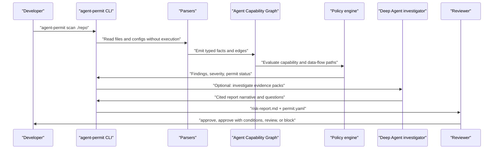
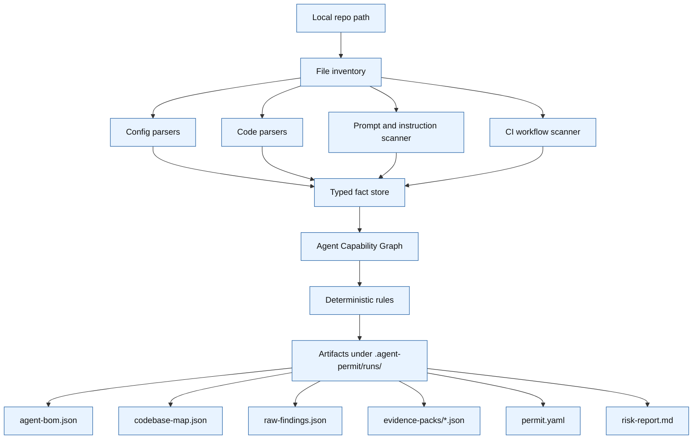
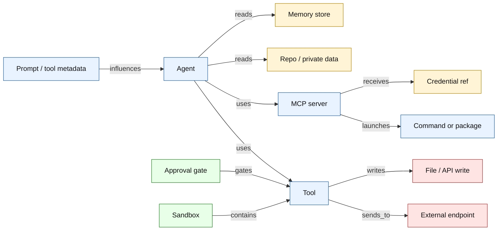
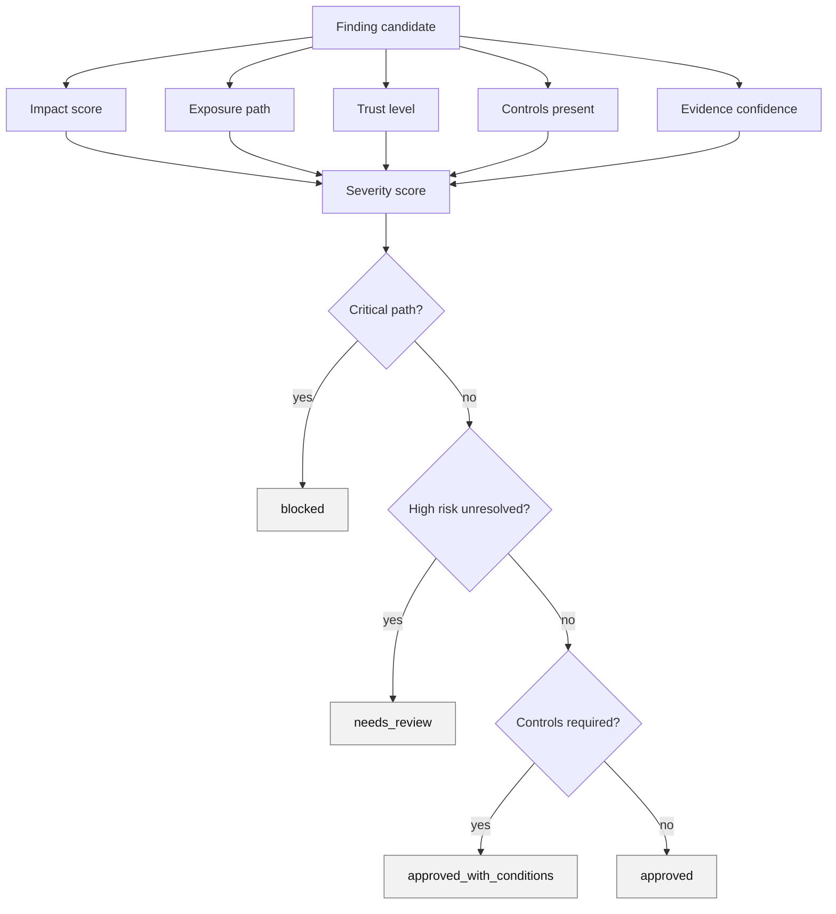
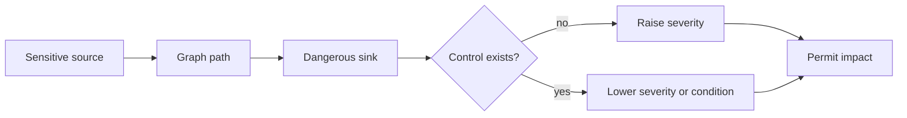
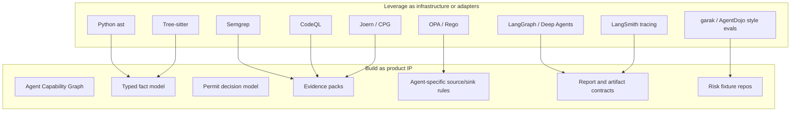
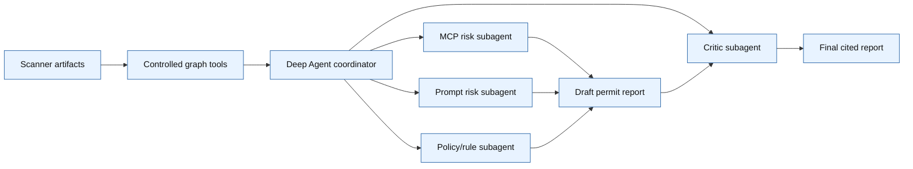
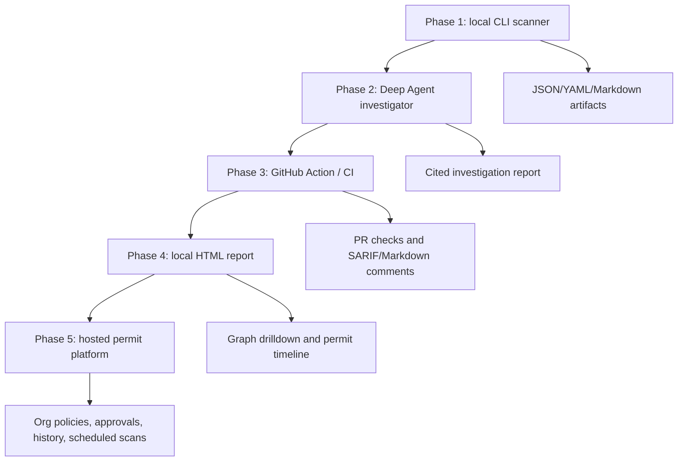
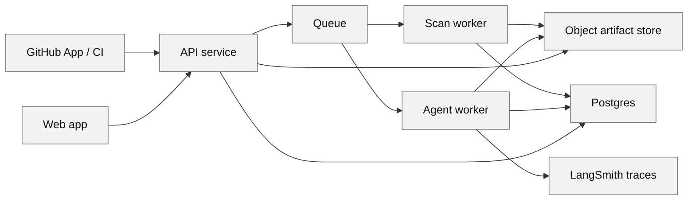

# Agent Permit Office End-To-End System Diagram

Date: 2026-06-06

## Problem

Teams need a repeatable way to decide whether an AI agent should receive tools, credentials, memory, network access, repo access, CI permissions, or production access.

The system must answer:

```text
Can this agent be permitted to run with these capabilities?
```

Not:

```text
Does an LLM think this repo looks safe?
```

## Core System Shape

```mermaid
flowchart LR
  User["Developer / security reviewer"] --> Target["Agent repo or workflow"]
  Target --> Scanner["Deterministic scanner runner"]
  Scanner --> Facts["Typed facts"]
  Facts --> ACG["Agent Capability Graph"]
  ACG --> Rules["Policy and source/sink rules"]
  Rules --> Findings["Line-cited findings"]
  Findings --> Permit["Permit decision"]
  Findings --> Evidence["Evidence packs"]
  Evidence --> DeepAgent["Deep Agent investigator"]
  Permit --> Report["Risk report"]
  DeepAgent --> Report
  Report --> Human["Human approval or remediation"]

  classDef build fill:#e8f3ff,stroke:#2663a6,color:#111;
  classDef leverage fill:#f2f2f2,stroke:#777,color:#111;
  class Scanner,Facts,ACG,Rules,Findings,Permit,Evidence,Report build;
  class DeepAgent leverage;
```



Main decision:

- build scanner, graph, rules, evidence, permit model ourselves
- leverage LangGraph/Deep Agents for investigation and report synthesis
- leverage external scanners as adapters only after our IR exists

## Why This Architecture

The product has to be defensible. Buyers will not trust a black-box agent to approve another agent.

So the system separates:

- evidence collection
- risk modeling
- permit decision
- narrative explanation

The Deep Agent is useful, but not as the authority. It is the investigator and writer over already-collected evidence.

## End-To-End Workflow



## Phase 1 Boundary

Phase 1 must be small and strict.



Phase 1 does not:

- execute MCP servers
- call remote tools
- read secret values
- let an LLM decide findings
- run shell commands inside target repo
- require hosted infra

## Agent Capability Graph

The graph is the core product asset.



The scanner asks graph questions:

- What can this agent read?
- What can it write?
- What can it send externally?
- Which credentials cross into which tools?
- Which prompts or tool descriptions can influence control flow?
- Which dangerous actions have approval gates?
- Which MCP servers are unpinned or unauthenticated?

## Permit Decision Engine



Outcome meanings:

| Outcome | Meaning | Example |
| --- | --- | --- |
| `approved` | No blocking path found. Controls acceptable. | Read-only local assistant with no external sink. |
| `approved_with_conditions` | Safe only if listed controls remain true. | GitHub token must be read-only and MCP package pinned. |
| `needs_review` | Real risk path exists, but human context may decide. | Slack send tool exists, but manual business process may require it. |
| `blocked` | Unsafe path should not run with current permissions. | Untrusted PR context plus write token plus agent execution. |

## Decision Rules

Rules should compose facts. They should not just match strings.



Example source-to-sink paths:

| Source | Sink | Missing control | Result |
| --- | --- | --- | --- |
| `GITHUB_TOKEN` | unpinned stdio MCP process | package pinning, token scope | high |
| repo/private files | Slack/email/network send | human approval | critical |
| prompt/tool metadata | shell/GitHub/cloud write | trusted control boundary | high |
| PR content | CI job with write token | permission hardening | critical |
| model output | memory write | memory quarantine | medium |

## Build Versus Leverage



| Layer | Build | Leverage | Reason |
| --- | --- | --- | --- |
| Agent security IR | Build | Joern/CodeQL concepts | Existing tools model code vuln paths, not agent permits. |
| Repo parsing | Build thin wrappers | Python `ast`, Tree-sitter | Parsers are commodity. Our value is normalized facts. |
| Taint/source-sink rules | Build first rule set | CodeQL, Semgrep, Pysa concepts | Need agent-specific sources and sinks. |
| General SAST | Adapter later | Semgrep, CodeQL, Joern | Useful signal, but not core permit logic. |
| Policy decisions | Build early | OPA/Rego later | Python rules faster now; Rego useful for enterprise policy. |
| Investigation agent | Leverage | LangGraph/Deep Agents | Strong fit after evidence exists. |
| Tracing/evals | Leverage | LangSmith | Useful for agent trajectory and report quality. |
| Dynamic red-team | Leverage patterns | garak, AgentDojo, ChainFuzzer | Later phase after deterministic scanner works. |

## Deep Agent Role

Deep Agent comes after deterministic artifacts.



Allowed Deep Agent tools:

- `get_finding(finding_id)`
- `find_paths(source_type, sink_type, max_depth)`
- `get_agent_bom()`
- `get_mcp_servers()`
- `get_credential_refs()`
- `get_evidence_pack(finding_id)`
- `explain_rule(rule_id)`

Blocked Deep Agent tools in early phases:

- shell execution
- target repo write access
- MCP server execution
- remote network calls
- secret value access
- unrestricted raw graph queries

Decision:

> Deep Agent explains and critiques. It does not create scanner truth.

## Product Surface Over Time



The CLI stays important. It proves the core product without auth, billing, cloud, or deployment complexity.

## Hosted Architecture Later

Do not build this first.



Hosted services:

| Service | Responsibility | Build now? |
| --- | --- | --- |
| API service | auth, scan runs, reports, approvals | no |
| Scan worker | clone repo, run deterministic scanner | no |
| Agent worker | run Deep Agent over artifacts | no |
| Artifact store | evidence, reports, traces | local filesystem now |
| Database | users, repos, runs, policies, approvals | no |
| Queue | scan and investigation jobs | no |
| Web app | report review and permit timeline | no |

## What The User Sees

### Local CLI

```text
agent-permit scan ./my-agent-repo

Permit: needs_review
Findings: 2 critical, 3 high, 4 medium
Artifacts: .agent-permit/runs/2026-06-06T...
Next: open risk-report.md
```

### Risk Report

```text
Permit: approved_with_conditions

Conditions:
- Pin github-mcp-server to an exact package version.
- Replace broad GITHUB_TOKEN with read-only token.
- Add approval gate before Slack send.

Evidence:
- .mcp.json:4-12
- agents/support.py:31-49
- .github/workflows/agent.yml:8-24
```

### CI

```text
Agent Permit Office: blocked

Reason:
Untrusted PR workflow can run agent with write-token access.
```

## Main Architecture Decisions

### Decision 1: Build From Ground Up

Reason:

- product value is the permit model, not a generic Deep Agent demo
- scanner truth must be reproducible
- artifact contract must be ours

Leverage:

- LangGraph/Deep Agents later for investigation
- Semgrep/CodeQL/Joern later as adapters

### Decision 2: Graph First, Not LLM First

Reason:

- source-to-sink paths need repeatable evidence
- buyers need line citations
- false positives can be tested against fixtures

Leverage:

- CodeQL/Pysa/Semgrep method vocabulary
- Joern graph architecture pattern

### Decision 3: Deep Agent As Investigator

Reason:

- Deep Agents are good for decomposition, synthesis, and critique
- they are weaker as primary evidence collectors for security decisions

Outcome:

- better report quality
- less context waste
- less prompt-injection exposure

### Decision 4: External Scanners As Adapters

Reason:

- external scanners provide useful signals
- none owns the agent permit workflow end to end

Outcome:

- avoid becoming only a Semgrep rule pack
- still benefit from mature SAST tools

### Decision 5: Dynamic Fuzzing Later

Reason:

- dynamic testing needs harnesses, mocked credentials, sinks, and replay
- static graph should first identify which paths matter

Outcome:

- later red-team tests target real risk paths instead of random prompts

## Non-Goals For MVP

- hosted SaaS
- billing
- production credential scanning
- live MCP execution
- auto-remediation
- broad vuln scanner replacement
- RL classifier
- real exploit execution against live systems

## Build Order

1. Define Pydantic schemas for facts, nodes, edges, findings, evidence, permit.
2. Build file inventory and high-signal file classifier.
3. Build MCP config scanner.
4. Build Python AST capability scanner.
5. Build prompt/instruction scanner.
6. Build GitHub Actions workflow scanner.
7. Build Agent Capability Graph.
8. Build first 15 to 25 source/sink rules.
9. Emit `agent-bom.json`, `codebase-map.json`, `raw-findings.json`, `permit.yaml`, `risk-report.md`.
10. Add fixture repos and expected permit outcomes.
11. Add Deep Agent investigator over evidence packs.
12. Add CI mode.

## Success Criteria

Phase 1 is useful when it can scan a real agent repo and answer:

- what agent frameworks are present
- what tools/MCP servers exist
- what credentials are referenced
- what data the agent can read
- what sinks it can write/send/execute
- what controls exist
- what permit status is justified
- which lines prove each claim

## Bottom Line

The system diagram is:

```text
parsers -> facts -> Agent Capability Graph -> source/sink policy -> permit -> Deep Agent explanation
```

Build the middle. Leverage the edges.

